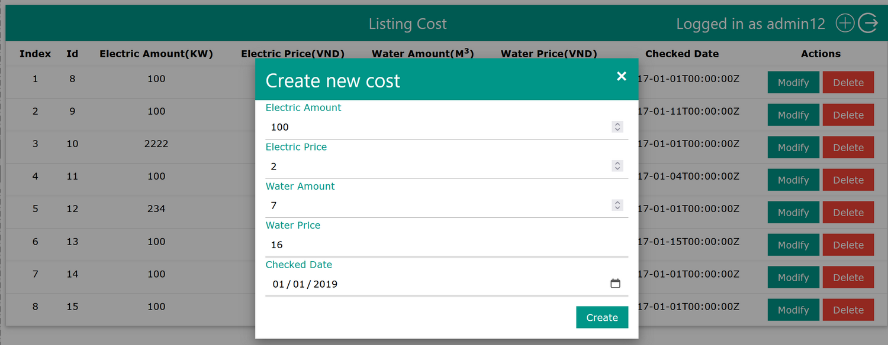
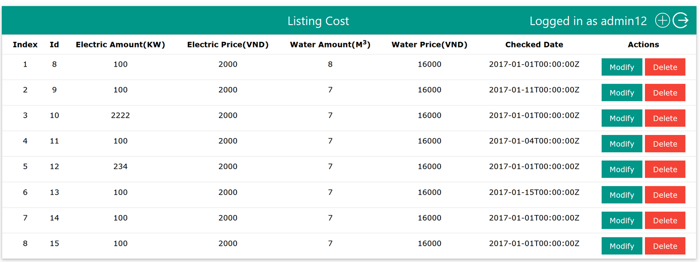

[](https://travis-ci.org/yonush/pwrcost)

# Introduction
This sample aim to demonstrate a basic RESTful API - based off [famcost](https://github.com/thanhngvpt/famcost). It uses mostly built-in Go's packages such as `net/http`, `database/sql`, `strconv`, `html/template` and use a third party packages `gorilla/mux` for teh router and `jackc/pgx` for the PostegreSQL driver

This partial application was created to demonstrate the following:</p>

- Go HTML templates with [W3.CSS](https://www.w3schools.com/w3css/w3css_examples.asp) stylesheet
- RESTful API with gorilla/mux 
- Data storage using PostgreSQL - tested with 15.4.1
- View a record details and add/edit records 
- No filtering has been implemented

The application is a standalone demo requiring no additional WAMP/LAMP dependencies. It has been built and tested on Windows, standalone Ubuntu Linux and WSL:Ubuntu. If the application requires rebuilding, there are two batch files provided. The rebuild assumes there is an existing Go installation on the host computer. The provided batch files will download the required 3rd party packages for the build process.

# TODO
- :white_check_mark: basic session handling
- :white_check_mark: sort by column
- :white_large_square: update CRUD to support filtering by userid
- :white_large_square: unit tests
- :white_large_square: search for a record

## Building
This application uses the Go programming language - where the latest was [Go 1.21.x](https://go.dev/dl/) as of writing this application. If you do not have Go installed on your system, you can acquire a copy from [Go.dev](https://go.dev/dl/). The go1.21.0.windows-amd64.msi was used to build this application.


### Database configuration
The app assumes a database exists - ESD. Edit the *app.go* to change the default database name. Database defaults in the *app.go* are shown below.

``` go
const (
	host     = "localhost"
	port     = 5432
	user     = "postgres"
	password = "postgres"
	dbname   = "ESD"
)
```
To run the server on your Windows system:

1. Run `buildpkg.cmd` in the root of the repo to build the binary (`pwrcost.exe`) using non vendored packages
1. Run `buildvendor.cmd` in the root of the repo to build the binary (`pwrcost.exe`) with the vendor
1. Run the binary `pwrcost.exe` or used the run.cmd (has env variable set)
1. Browse to [http://localhost:8080](http://localhost:8080) to test the application out. If port 80 does not work, you can start the app as follows.

    ``` sh
        > pwrcost 8080
    ```  
### Non Windows
Testing has been performed on WSL & Linux but not MacOS. However, the commands in buildpkg.cmd and buildvendor.cmd can be run manually to build and run this demo.

#### Build by pkg

``` bash
export GO111MODULE="on"
export GOFLAGS="-mod=mod"
go mod download
:: strip debug info during build
go build -ldflags="-s -w" .

``` 
#### Build by vendor

``` bash
export GO111MODULE="on"
export GOFLAGS="-mod=vendor"
go mod vendor
:: strip debug info during build
go build -ldflags="-s -w" 
```

### Dependencies
The application uses the following Go packages to build;

- [Datastore: PostgreSQL driver](https://github.com/jackc/pgx/)
- [HTTP router: Gorilla mux](https://github.com/gorilla/mux)

## Datastore

This version application requires a separate database to function - PostgreSQL. A few CSV files are imported from the local data folder. This will be imported when the application is run for the first time. Thereafter the application will use the database each time it is executed.

## Session management

The application uses the [icza/session](https://github.com/icza/session) module to handle some basic sessions for the authentication.
Refer to [auth.go](https://github.com/yonush/pwrcost/blob/main/auth.go) for the basic authentication.

Alternate session management can be found at the following sources:

- [swithek/sessionup](https://github.com/swithek/sessionup) Simple, yet effective HTTP session management and identification package
- [gorilla/sessions](https://github.com/gorilla/sessions) - provides cookie and filesystem sessions and infrastructure for custom session backends along with the gorilla mux
- [alexedwards/scs](https://github.com/alexedwards/scs) - session management with over 19 different datastores
- [adam-hanna/sessions](https://github.com/adam-hanna/sessions) - A dead simple, highly performant, highly customizable sessions service for go http servers using redis as a datastore.

## Testing the API

Refer to the following articles on creating tests for RESTful APIs
- [Get Started Testing an API Built With Golang](https://www.twilio.com/blog/get-started-testing-api-built-with-golang)
- [Develop REST API using Go and Test using various methods](https://dev.to/chefgs/develop-rest-api-using-go-and-test-using-various-methods-8e0)
- [Testing REST API in Go with Testify and Mockery](https://medium.com/nerd-for-tech/testing-rest-api-in-go-with-testify-and-mockery-c31ea2cc88f9)

## Sample screens

